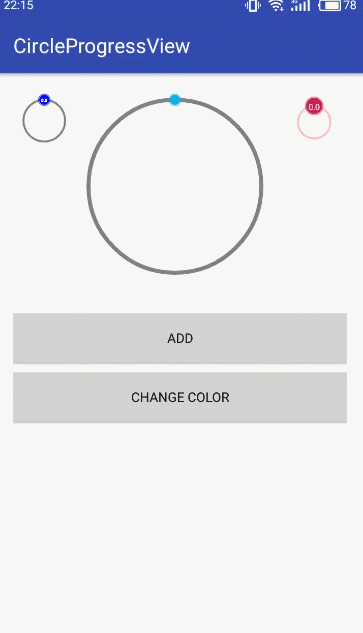

# CircleProgressView
一个圆型进度条，带头部进度显示，颜色、宽度大小等高度可配置

# 效果



## 支持属性
#### CircleProgressView

|         属性名          |                 属性说明           |     类型       |
| :------------------: | :-------------------------------: |:--------------:|
| progressBackgroundColor  |           进度条背景色        | color        |
|  progressColor  |              进度条前景色              | color        |
|  progressHeadColor   |       头部圆圈颜色                |   color      |
|  textColor   |               头部进度文字字体颜色            |   color      |
|  startupText   |               是否显示文字进度(boolean) |   boolean    |
|progressBackgroundWidth| 进度条背景宽度                   | dimension     |
|progressWidth  |           进度条宽度                      |dimension    |
|progressHeadRadius |      头部圆圈半径                   |dimension    |
|textSize       |           头部进度文字大小               |dimension    |
|maxProgressValue   |       最大进度                        |integer   |
|progressValue      |       当前默认进度                     |integer   |

## 使用


- 在布局文件中添加CircleProgressView并设置相关自定义属性

```xml
 <com.bolex.circleprogresslibrary.CircleProgressView
            android:id="@+id/circleProgressView2"
            android:layout_width="0dp"
            android:layout_height="100dp"
            android:layout_weight="1"
            app:progressBackgroundColor="#F8BBD0"
            app:progressColor="#536DFE"
            app:progressHeadColor="#C2185B"
            app:progressHeadRadius="8dp"
            app:textColor="#F8BBD0"
            app:textSize="18px" />
```

2.java代码

- 进度获取和设置

``` java
mCircleProgressView.getmProgressValue();
mCircleProgressView1.setProgress(10);

```

- 颜色和大小等属性配置 Api请参考属性表

```java
mCircleProgressView.setmProgressBackgroundColor();
mCircleProgressView.setmProgressHeadColor();
mCircleProgressView.setmProgressColor();
mCircleProgressView.setmProgressHeadColor();

mCircleProgressView.setmTextSize();
mCircleProgressView.setmTextColor();
mCircleProgressView.setmStartupText();
mCircleProgressView.setmProgressWidth();

mCircleProgressView.setmProgressBackgroundWidth()
mCircleProgressView.setmProgressWidth()

mCircleProgressView.setmMaxProgressValue()
mCircleProgressView.setmProgressHeadRadius()

```


